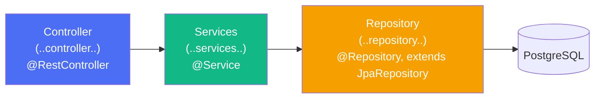
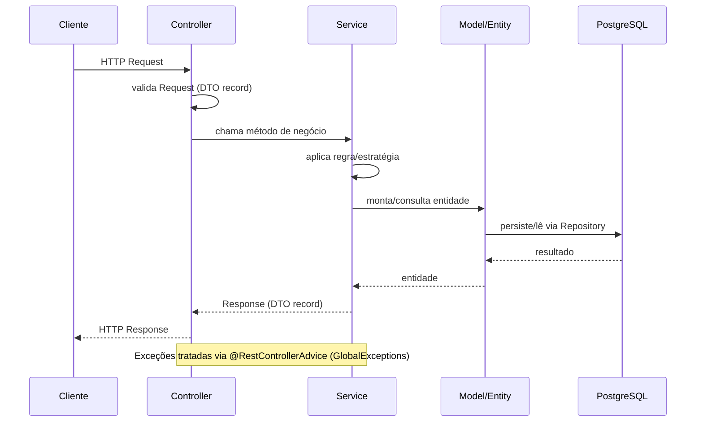
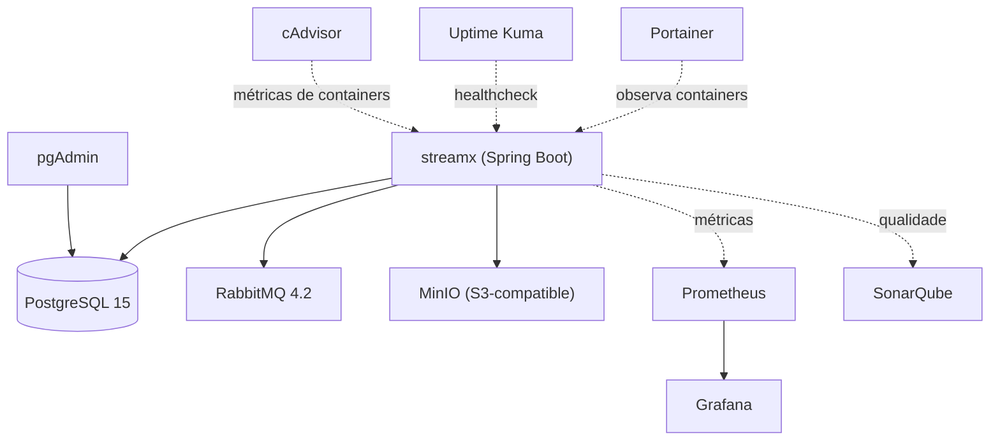
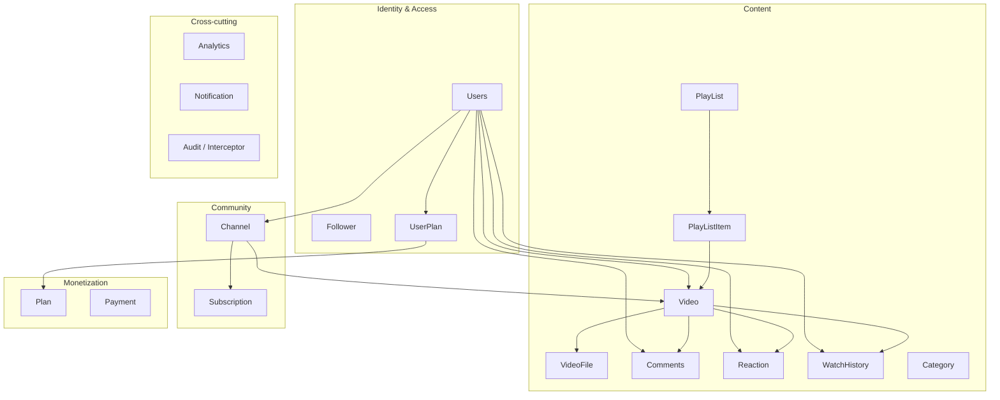
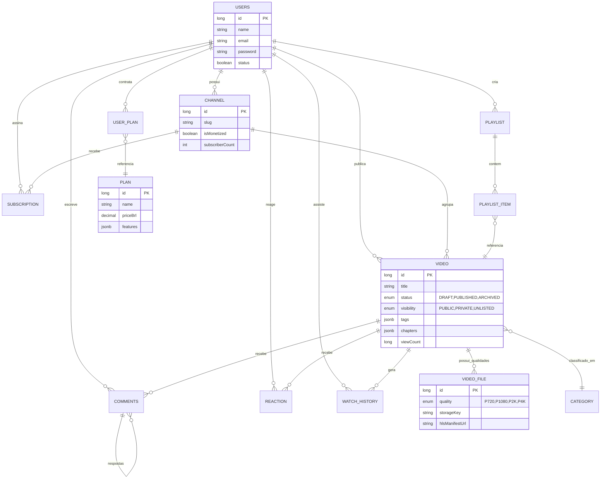
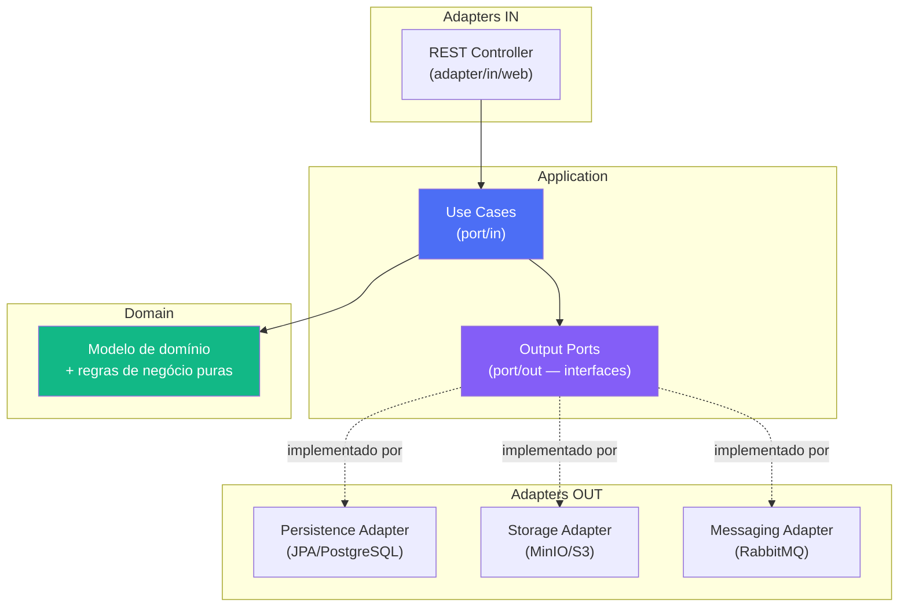
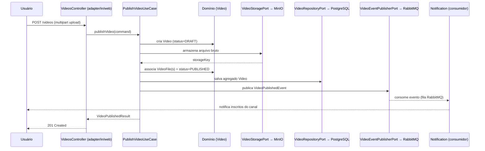
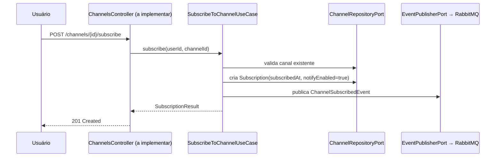

# System Design — StreamX (Streaming-Video-Back-End)

### Padre Community · Loid Community — Plataforma de Streaming de Vídeo

---

## 1. Sumário executivo

O StreamX é uma plataforma de streaming de vídeo (estilo Vimeo/YouTube), implementada como um **monólito modular** em
Java 21 + Spring Boot 3, com persistência em PostgreSQL, armazenamento de objetos em MinIO e mensageria assíncrona via
RabbitMQ. O projeto já adota práticas maduras de engenharia — ArchUnit, Testcontainers, mutation testing (PITest),
Jacoco, SonarQube, pipeline CI/CD via GitHub Actions e observabilidade com Prometheus/Grafana — mas a arquitetura de
código em si ainda está na camada clássica **Controller → Service → Repository → Model**

---

## 2. Contexto do produto

Com base no README do repositório, o produto oferece:

- Cadastro e listagem de usuários, com busca por nome/sobrenome e filtros por prefixo/sufixo
- Publicação de vídeos e comentários
- Sistema de "seguir" usuários e "inscrever-se" em canais
- Modelo de inspiração: Vimeo, Wistia, Brightcove, YouTube

---

## 3. Stack tecnológica real (extraída do `pom.xml` e `docker-compose.yml`)

| Categoria                                                     | Tecnologia                                                                                                           | Observação                                                                                                   |
|---------------------------------------------------------------|----------------------------------------------------------------------------------------------------------------------|--------------------------------------------------------------------------------------------------------------|
| Linguagem / Runtime                                           | Java 21, Spring Boot 3.5.16                                                                                          | `artifactId: streamx`                                                                                        |
| Web                                                           | Spring Web MVC + Spring WebFlux                                                                                      | WebFlux presente nas dependências, mas sem uso (por enquanto) identificado nos controllers atuais            |
| Persistência                                                  | Spring Data JPA + Hibernate, PostgreSQL 15                                                                           | `ddl-auto=update` (⚠️ ver seção 8 — Riscos)                                                                  |
| Armazenamento de objetos                                      | MinIO (SDK `io.minio:minio:8.6.0`)                                                                                   | Para vídeos/thumbnails/avatars                                                                               |
| Mensageria                                                    | RabbitMQ (`spring-boot-starter-amqp`)                                                                                | Config presente, porém com exchange/queue placeholders (`"-"`) — ainda não ligada a um fluxo de negócio real |
| Segurança                                                     | `spring-security-crypto` (hash de senha)                                                                             | Sem Spring Security completo, sem JWT implementado ainda                                                     |
| 2FA (dependências presentes, não implementadas no controller) | `googleauth` (TOTP), ZXing `core`/`javase` (QR Code)                                                                 | `AuthController` é hoje um stub vazio                                                                        |
| Documentação de API                                           | springdoc-openapi (Swagger UI)                                                                                       | `/swagger-ui/index.html`                                                                                     |
| Observabilidade                                               | Actuator, Micrometer + Prometheus, Grafana                                                                           | Métricas expostas em `/actuator/prometheus`                                                                  |
| Qualidade                                                     | ArchUnit 1.4.2, JaCoCo, PITest (mutation testing), SonarQube, Testcontainers                                         | Governança arquitetural ativa via `archtest/`                                                                |
| CI/CD                                                         | GitHub Actions (`develop.yml`, `master.yml`, `pr.yml`, `release.yml`)                                                | + Semgrep/CodeQL/OWASP/CodeRabbit conforme prática já usada por Ivan em outros projetos                      |
| Infra local                                                   | Docker Compose: Postgres, RabbitMQ, MinIO, Prometheus, Grafana, SonarQube, pgAdmin, Portainer, Uptime Kuma, cAdvisor |                                                                                                              |

---

## 4. Arquitetura atual (AS-IS)

### 4.1 Módulos reais (bounded contexts de fato)

Pacote raiz: `api.core.streamx.modules.*`

| Módulo            | Maturidade              | O que existe hoje                                                                                                                                                                          |
|-------------------|-------------------------|--------------------------------------------------------------------------------------------------------------------------------------------------------------------------------------------|
| **users**         | 🟢 Funcional (parcial)  | `UsersController`, `UsersServices` (apenas `registerUser`), `UsersRepository`, entidades `Users`, `Follower`, `UserPlan`                                                                   |
| **videos**        | 🟡 Scaffolding + regras | `VideosController`, `PlayListController`, `VideosServices` (mínimo), entidades ricas: `Video`, `VideoFile`, `PlayList`, `PlayListItem`, `Comments`, `Reaction`, `WatchHistory`, `Category` |
| **channels**      | 🟠 Só modelo            | `Channel`, `Subscription` + repositórios — sem controller/service                                                                                                                          |
| **billing**       | 🟠 Só modelo            | `Plan` + `BillingServices`/`BillingController` stub                                                                                                                                        |
| **payment**       | 🔴 Stub                 | `Payment` (model) + controller/service vazios                                                                                                                                              |
| **notification**  | 🔴 Stub                 | Controller/service vazios                                                                                                                                                                  |
| **analytics**     | 🔴 Stub                 | `Analytics` (model), DTOs, controller/service quase vazios                                                                                                                                 |
| **audit**         | 🟡 Transversal          | `LogProcessorInterceptor` + `InterceptorConfig` (interceptor HTTP)                                                                                                                         |
| **exception**     | 🟢 Funcional            | `GlobalExceptions` (`@RestControllerAdvice`), `EmailAlreadyExistsException`                                                                                                                |
| **configuration** | 🟢 Funcional            | `MinioConfig`, `RabbitMQConfig`, `RestTemplateConfig`, `PasswordEncoderField`                                                                                                              |
| **gateway**       | 🔴 Stub vazio           | `GatewayController` e `GatewayProcessor` são classes vazias — não há um API Gateway real hoje, apesar de aparecer no diagrama aspiracional                                                 |
| **auth**          | 🔴 Stub                 | `AuthController` vazio — autenticação/2FA ainda não implementada nesta base, apesar das dependências (`googleauth`, `zxing`) já estarem no `pom.xml`                                       |

### 4.2 Padrão de camadas (imposto via ArchUnit)

Os testes em `src/test/.../archtest/{módulo}/*ArchTest.java` (ex.:
`VideosArchTest`, `UsersArchTest`, `ChannelsArchTest`, `NotificationArchTest`,
`AuditArchTest`) já **codificam formalmente** a arquitetura em camadas atual, por módulo:

Regras hoje aplicadas por ArchUnit (resumo, consistente em todos os módulos):

- `Controller` não pode ser acessado por nenhuma camada; `Services` só pode ser acessado por `Controller`; `Repository`
  só pode ser acessado por `Services`.
- `Controller` nunca pode depender diretamente de `Repository`.
- Classes `@Entity` devem residir em `..model..` e implementar `Serializable`.
- Campos de entidades e de `@Service` devem ser privados (encapsulamento).
- DTOs (`..dto..`) devem ser `record` (imutabilidade).
- Repositórios devem ser interfaces `@Repository` que estendem `JpaRepository`.
- Serviços não podem usar `@Component` (só `@Service`) e devem terminar com `Services`.
- Proibido *field injection* (`GeneralCodingRules.NO_CLASSES_SHOULD_USE_FIELD_INJECTION`) e uso de `java.util.logging`.

### 4.3 Fluxo de requisição padrão (confirmado em `docs/FLUXO.png`)

### 4.4 Infraestrutura local (`docker-compose.yml`)

### 4.5 Gap AS-IS vs. aspiracional

| Elemento no `docs/ARCHITECTURE.png` (aspiracional)                           | Existe no código hoje?                                                                |
|------------------------------------------------------------------------------|---------------------------------------------------------------------------------------|
| API Gateway dedicado                                                         | ❌ Só stub vazio (`GatewayController`/`GatewayProcessor`)                             |
| Serviços separados (Upload, Transcoding, Metadata, Auth, Analytics, Billing) | ❌ Tudo roda como módulos dentro de um único deployable                               |
| CloudFront (CDN)                                                             | ❌ Não configurado                                                                    |
| S3                                                                           | 🟡 Equivalente local: MinIO (compatível com S3)                                       |
| Redis                                                                        | ❌ Não presente                                                                       |
| Elasticsearch                                                                | ❌ Não presente                                                                       |
| RabbitMQ                                                                     | 🟡 Presente, mas config é placeholder — nenhum evento de domínio real publicado ainda |
| Load Balancers                                                               | ❌ Não aplicável no estágio atual (monólito único)                                    |

---

## 5. Modelo de domínio (DDD) e dados

### 5.1 Bounded contexts identificados

### 5.2 ERD resumido (entidades confirmadas em `docs/ENTITIES_DOCUMENTATION.md`)

**Observação de modelagem**: `Video` já modela múltiplas qualidades via
`VideoFile` (720p/1080p/2K/4K) e referencia `hlsManifestUrl` — ou seja, o domínio já foi desenhado pensando em ABR
(Adaptive Bitrate Streaming/HLS), mesmo sem o pipeline de transcodificação implementado ainda.

---

## 6. Arquitetura alvo (TO-BE) — Hexagonal dentro do monólito modular

**Princípio guia**: manter um único deployable (o monólito modular já é uma escolha correta neste estágio do produto),
mas isolar o domínio de framework/infra em cada módulo. Isso resolve o problema real hoje:
as regras de `@Service` estão acopladas a JPA/Spring, o que torna a evolução para eventos (RabbitMQ), múltiplos adapters
de storage (MinIO/S3) ou futura extração de serviços muito mais custosa.

### 6.1 Diagrama de Visão por Módulo

### 6.2 Mapeamento módulo a módulo (prioridade sugerida)

| Módulo                | Prioridade de "hexagonalização" | Justificativa                                                                                                                      |
|-----------------------|---------------------------------|------------------------------------------------------------------------------------------------------------------------------------|
| **videos**            | 🔴 Alta                         | Módulo central do produto; já tem `VideoFile`/HLS modelado; vai precisar de múltiplos adapters de storage/transcodificação         |
| **users**             | 🔴 Alta                         | Único módulo com regra de negócio real hoje (`registerUser`); base para autenticação futura                                        |
| **channels**          | 🟡 Média                        | Modelo pronto, falta caso de uso; bom candidato para nascer já hexagonal                                                           |
| **billing / payment** | 🟡 Média                        | Vai integrar gateway de pagamento externo — porta de saída (`PaymentGatewayPort`) evita acoplar o domínio a um provedor específico |
| **notification**      | 🟢 Baixa (mas fácil)            | Nasce vazio — desenhar direto com `Notification` (email/push/RabbitMQ) evita retrabalho                                            |
| **analytics**         | 🟢 Baixa                        | Pode consumir eventos de domínio publicados pelos demais módulos via RabbitMQ, sem acoplamento direto                              |
| **gateway**           | ⏸️ Adiar                         | Só faz sentido implementar um Gateway real quando houver mais de um serviço para rotear — hoje é prematuro                         |

---

## 7. Fluxos-chave (estado alvo)

### 7.1 Publicação de vídeo (upload → storage → evento → notificação)

### 7.2 Inscrição em canal (Follow/Subscribe)

---

## 8. ADRs (Architecture Decision Records)

### ADR-001 — Monólito modular como estilo arquitetural atual

**Status**: Aceito (implícito no código atual)
**Contexto**: o diagrama `ARCHITECTURE.png` sugere microsserviços, mas o time é pequeno e o domínio ainda está se
estabilizando. **Decisão**: manter um único deployable Spring Boot, dividido em módulos internos por bounded context,
com fronteiras reforçadas por ArchUnit. **Consequência**: menor custo operacional agora; exige disciplina para não
deixar os módulos se acoplarem entre si (usar eventos via RabbitMQ para comunicação entre módulos, não chamadas diretas
de service-a-service).

### ADR-002 — MinIO como storage de objetos (compatível S3)

**Status**: Aceito **Contexto**: necessidade de armazenar vídeo bruto e variantes por qualidade (`VideoFile`), sem custo
de nuvem em ambiente local/dev. **Decisão**: usar MinIO local, com API compatível S3 — permite trocar por AWS S3 em
produção sem reescrever o adapter, **desde que o storage seja isolado atrás de uma porta** (`VideoStoragePort`), o que
hoje ainda não existe.

### ADR-003 — RabbitMQ como broker de mensageria

**Status**: Aceito, porém não operacionalizado **Contexto**: comunicação assíncrona entre módulos (ex.: vídeo
publicado → notificar inscritos; assinatura → atualizar contadores). **Decisão**: usar RabbitMQ (exchange direta) em vez
de Kafka, dado o volume esperado nesta fase e a topologia simples request/notify. **Pendência**: `RabbitMQConfig` hoje
declara exchange/queue/binding com nomes placeholder (`"-"`) — precisa ser modelado por evento de domínio real (ex.:
`video.published`, `channel.subscribed`).

### ADR-004 — PostgreSQL + JSONB para campos semiestruturados

**Status**: Aceito **Contexto**: `Video.tags`, `Video.chapters` e `Plan.features` variam em forma e não justificam
tabelas normalizadas à parte nesta fase. **Decisão**: usar colunas `JSONB` no Postgres. **Consequência**: consultas por
conteúdo desses campos exigirão índices GIN futuramente se o volume crescer.

### ADR-005 — ArchUnit como guarda-corpo arquitetural

**Status**: Aceito e em uso **Decisão**: cada módulo tem seu próprio `*ArchTest` (`UsersArchTest`, `VideosArchTest`,
`ChannelsArchTest`, `NotificationArchTest`, `AuditArchTest`), validando layering, nomenclatura, encapsulamento e
proibição de field injection. **Próximo passo (proposto neste documento)**: estender essas regras para impor a fronteira
hexagonal (`domain` não depende de Spring/JPA) conforme a migração da seção 6 avançar módulo a módulo.

---

## 9. Riscos e recomendações imediatas

| # | Achado                                                                                                    | Onde                                          | Recomendação                                                                                                                                                                   |
|---|-----------------------------------------------------------------------------------------------------------|-----------------------------------------------|--------------------------------------------------------------------------------------------------------------------------------------------------------------------------------|
| 1 | Credenciais do MinIO hardcoded no `MinioConfig`                                                           | `configuration/MinioConfig.java`              | Externalizar via `application.properties`/variáveis de ambiente (já existem `minio.server.url` comentado — só falta ligar)                                                     |
| 2 | RabbitMQ configurado com nomes placeholder                                                                | `configuration/RabbitMQConfig.java`           | Definir contrato de eventos de domínio (nome, payload versionado) antes de nomear exchanges/filas                                                                              |
| 3 | `ddl-auto=update`                                                                                         | `application.properties`                      | Migrar para Flyway/Liquibase antes de qualquer ambiente compartilhado                                                                                                          |
| 4 | Múltiplos módulos (`payment`, `billing`, `notification`, `analytics`, `auth`, `gateway`) são apenas stubs | vários                                        | Priorizar via roadmap (seção 10) em vez de abrir todos os módulos ao mesmo tempo                                                                                               |
| 5 | Sem autenticação/autorização implementada apesar de dependências de 2FA já presentes                      | `auth/controller/AuthController.java` (vazio) | Definir se o fluxo de 2FA dual-token (`PRE_AUTH`/`FULL_AUTH`) já validado em outro projeto será reaproveitado aqui                                                             |
| 6 | Divergência entre diagrama aspiracional (microsserviços) e código (monólito modular)                      | `docs/ARCHITECTURE.png` vs. código            | Manter o diagrama como "visão de destino de longo prazo" e adicionar este documento como "estado atual" — evita expectativa equivocada para novos contribuidores da comunidade |

---

## 10. Roadmap de evolução arquitetural

| Fase                                                                | Foco                                                                        | Entregas-chave                                                                                                                                                                                                               |
|---------------------------------------------------------------------|-----------------------------------------------------------------------------|------------------------------------------------------------------------------------------------------------------------------------------------------------------------------------------------------------------------------|
| **Fase 1 — Consolidação do monólito modular**                       | Fechar o que já está desenhado                                              | Implementar casos de uso reais em `channels`, `billing`, `payment` (hoje só modelo); versionar schema com Flyway; externalizar credenciais do MinIO                                                                          |
| **Fase 2 — Hexagonalização por módulo**                             | Isolar domínio de infraestrutura                                            | Introduzir `domain/application/port/adapter` começando por `videos` e `users`; estender ArchUnit para impor a nova fronteira; nenhum novo módulo deve nascer fora do padrão hexagonal                                        |
| **Fase 3 — Comunicação orientada a eventos entre módulos**          | Reduzir acoplamento interno                                                 | Modelar eventos de domínio reais no RabbitMQ (`video.published`, `channel.subscribed`, `payment.confirmed`); `notification` e `analytics` passam a ser consumidores puros de eventos                                         |
| **Fase 4 — Autenticação e autorização**                             | Segurança de ponta a ponta                                                  | Implementar `AuthController` com JWT (+ 2FA TOTP via `googleauth`/ZXing, reaproveitando o padrão dual-token já validado em outro projeto de Ivan); proteger endpoints por papel                                              |
| **Fase 5 — Extração seletiva de serviços (se e quando necessário)** | Só migrar para microsserviço o que tiver justificativa de escala/isolamento | Candidatos naturais, dado o domínio: **Transcoding** (CPU-bound, escala independente) e **Notification** (I/O-bound, já desacoplado via evento desde a Fase 3). O `gateway` só passa a fazer sentido implementar nesse ponto |

---

## 11. Como este documento se conecta ao que já existe no repositório

- Substitui a leitura implícita de `docs/FLUXO.png` (seção 4.3) e formaliza o que os `ArchTest` já impõem em código
  (seção 4.2).
- Não contradiz `docs/ARCHITECTURE.png` — reposiciona-o como "visão de destino" (Fase 5), não como estado atual.
- Usa como fonte primária de dados `docs/ENTITIES_DOCUMENTATION.md` (seção 5).
- Os diagramas Mermaid deste arquivo renderizam nativamente na visualização de Markdown do GitHub, então este documento
  pode ser commitado direto em `docs/SYSTEM_DESIGN.md`.
